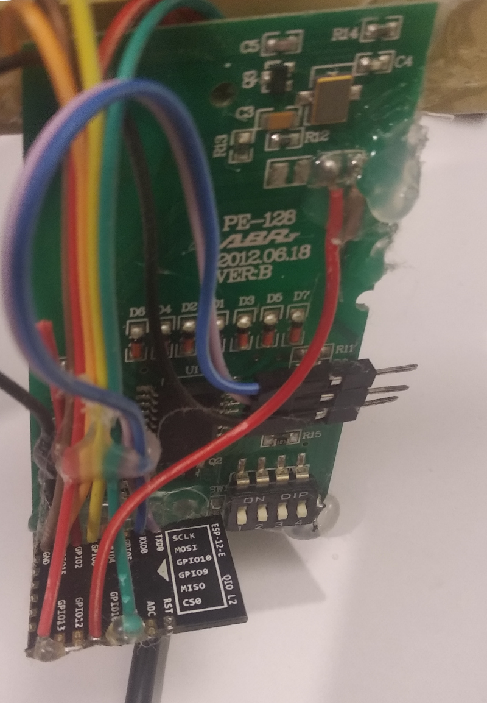
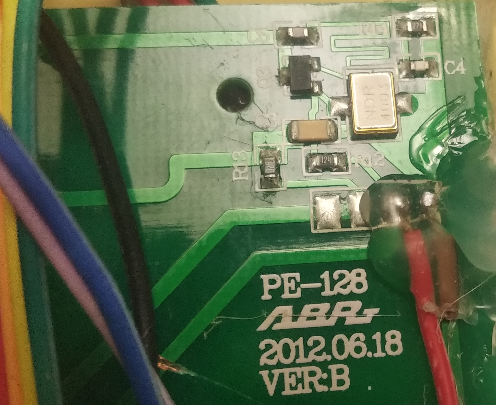

# arno-vx10
## Interface rf do controle remoto do ventilador

Os códigos e outros conteúdos deste repositório tem como intuito replicar o sinal rf enviado pelo controle do ventilador arno vx10.  

Como podem observar, capricho não é um requisito para que este projeto funcione.  

Apenas 4 componentes são necessários:  
1 - esp8266 ou esp32 (foi usado um esp12e)  
2 - conversor dc dc  
3 - fonte 12v  
4 - módulo rf (foi usado parte de um controle queimado)  
5 - botao para acender luz (opcional)  

O módulo rf está ligado à porta 14 do do esp e está sendo alimentado diretamente pela fonte.  
O esp tem a tensão regulada pelo conversor dc dc em 3.3v.  
O botão está conectado à porta 0, no caso do esp12e, ele é usado para que o microcontrolador entre no modo de programação.  

Creio que o módulo rf possa ser facilmente reproduzido com um ndr4003  
  

Obs, todo os switches de configuração do controle estão voltados para baixo.  
O código do último botão (timer) está incorreto, a correção será feita assim que eu abrir e analisar o controle novamente.